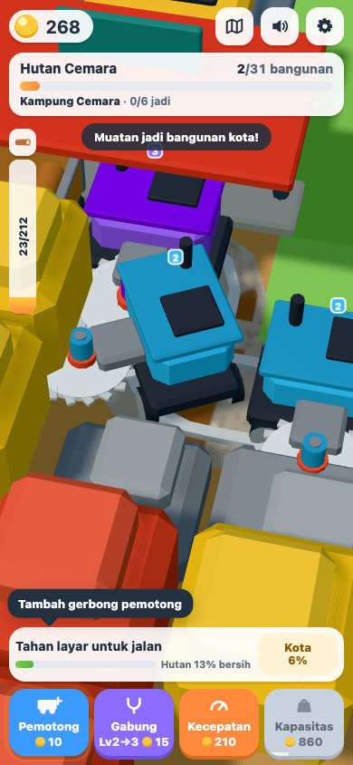
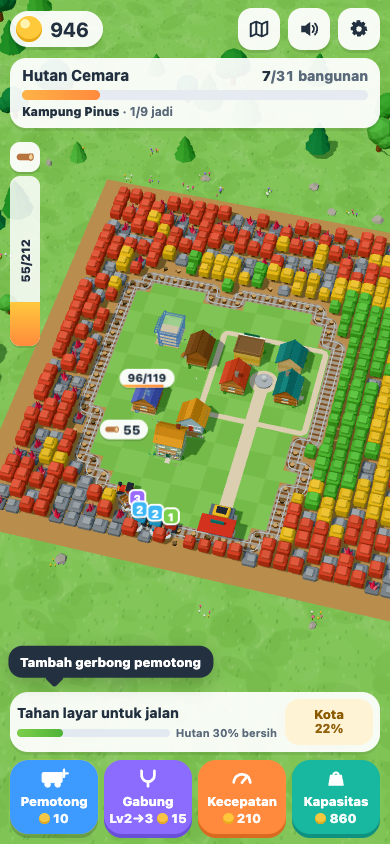
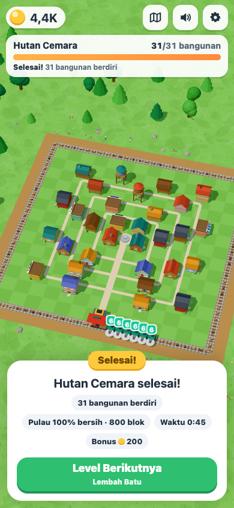
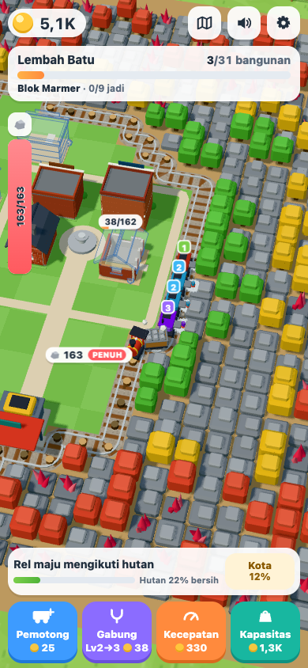

# Loop Builders — Tebang & Bangun

Game web 3D idle/clicker satu tangan (Vite + TypeScript + Three.js), mengikuti gaya *Train Miner: Idle Railway* (Flexus/Azur Games) dengan satu perbedaan besar: **hasil tebangan tidak dijual, tetapi dipakai membangun kota**.

Pulau berupa hutan voxel persegi yang tersusun rapi dalam baris-baris, dengan kota kecil di tengahnya. Sebuah kereta (lokomotif, satu gerbong muatan, lalu gerbong pemotong) berjalan di rel yang mengelilingi kota, **hanya selama pemain menahan atau mengetuk layar**. Gerinda horizontal yang menempel di sisi kiri tiap pemotong menggerus blok di baris terdepan. Begitu sepotong baris hancur, **rel di situ langsung maju satu baris**. Rel selalu lurus dengan belokan siku, jadi batu keras yang belum hancur dikitari dengan belokan berbentuk L. Muatan dibongkar di stasiun dan langsung dipasang ke bangunan kota di belakang rel. **Setiap bahan yang terpasang menjadi koin**, dan itulah satu-satunya sumber uang. Level selesai saat kota jadi dan pulau bersih 100%.

Semua visual dibuat prosedural dengan geometri Three.js, dan semua suara disintesis dengan Web Audio. Tidak ada aset eksternal, backend, login, iklan, atau pembayaran.

   

## Menjalankan

```bash
npm install
npm run dev      # buka URL yang dicetak Vite (default http://localhost:5180)
npm run build    # type-check (tsc) + build produksi ke dist/
npm run preview  # menyajikan hasil build
npm test         # unit test (Vitest)
npm run check    # tsc --noEmit + semua tes
npm run balance  # bot pacing: cetak timeline kedua level
npm run deploy   # build + publikasikan dist/ ke branch gh-pages (GitHub Pages)
```

Butuh Node 18+ dan browser dengan WebGL. Tambahkan `?frame=390x844` pada URL untuk memaksa ukuran kontainer ponsel di desktop (khusus pengujian).

## Kontrol

| Aksi | Sentuh / mouse | Keyboard |
| --- | --- | --- |
| Jalan | Tahan area dunia supaya kereta jalan; ketuk untuk maju sebentar. Tanpa sentuhan kereta diam. | Tahan `Spasi` |
| Geser kamera | Seret jari/mouse di area dunia (kamera kembali mengikuti kereta setelah ±3,5 dtk) | — |
| Zoom | Cubit dua jari / scroll mouse | — |
| Lihat seluruh pulau | Tombol peta di kanan atas | `O` |
| Tambah pemotong Lv1 | **Pemotong** | `A` |
| Gabung 2 pemotong setingkat | **Gabung** | `M` |
| Kereta lebih cepat | **Kecepatan** | `S` |
| Gerbong muatan lebih besar | **Kapasitas** | `C` |
| Level berikutnya | Tombol di panel selesai | `Enter` |

Ketukan pada tombol HUD tidak menjalankan kereta. Seretan lebih dari 12 px otomatis berubah dari jalan menjadi geser kamera.

## Loop permainan

1. **Jalan.** Kereta hanya bergerak selama layar ditahan (atau sebentar setelah diketuk). Gerinda hanya berputar dan memotong saat kereta bergerak.
2. **Menebang.** Tiap pemotong menggerus satu blok yang disentuh gerindanya, di sisi kiri rel (sisi hutan). Pohon hijau tumbang dalam sekali lewat, sedangkan pohon emas, pohon merah, batu, dan kristal butuh beberapa kali lewat atau beberapa pemotong. Hasilnya terbang ke gerbong muatan di belakang lokomotif.
3. **Rel maju.** Rel selalu lewat satu sel di depan baris terdepan. Begitu minimal 3 blok berjejer hancur, rel di situ maju satu baris lewat dua belokan siku. Blok keras yang tersisa dikitari rel dengan belokan L, lalu rel lurus lagi setelah bloknya hancur. Rel hanya pernah maju keluar. Kalau ada blok yang sampai terkurung di dalam rel, pekerja kota membongkarnya otomatis ke gudang.
4. **Muatan penuh.** Saat gerbong muatan penuh, gerinda berhenti dan label di atas kereta berubah menjadi **PENUH**. Blok yang sudah tumbang tetapi tidak muat ditahan sampai muatan dibongkar, sehingga tidak ada bahan yang hilang.
5. **Membangun.** Setiap kali lewat stasiun, seluruh muatan dibongkar ke gudang dan langsung dipasang ke bangunan kota yang sudah terbuka (isi-dulu, berurutan). Kavling terbuka begitu rel sudah melewatinya dengan jarak aman. Nilai bahan: kayu 1, batu 2, permata 5 poin. Setiap poin yang terpasang memberi 1 koin, dan bangunan yang selesai memberi bonus. Modul bangunan berubah dari ghost menjadi solid (fondasi → dinding → bukaan → atap → detail).
6. **Upgrade.** **Pemotong** menambah pemotong Lv1 di ujung kereta. **Gabung** menyatukan dua pemotong setingkat menjadi satu pemotong dengan gerinda lebih besar dan lebih cepat. **Kecepatan** mempercepat kereta, dan **Kapasitas** memperbesar gerbong muatan.
7. **Hutan tidak tumbuh lagi.** Total bahan di hutan sama persis dengan total biaya kota, jadi pulau bersih dan kota jadi terjadi bersamaan. Muncul confetti, kamera menyorot seluruh pulau, bonus diberikan, lalu tombol **Level Berikutnya** muncul.

## Konten

| Level | Tema | Tampilan bangunan | Distrik (cincin 1 → 4) | Bangunan |
| --- | --- | --- | --- | --- |
| 1 · Hutan Cemara | Hutan | Kayu | Alun-alun, Kampung Cemara, Kampung Pinus, Kampung Jati | Rumah kayu, rumah papan, warung, rumah panggung, lumbung, rumah loteng, menara air |
| 2 · Lembah Batu | Padang | Bata | Alun-alun Batu, Blok Granit, Blok Marmer, Blok Andesit | Rumah bata, toko roti, ruko, rumah bata tingkat, apartemen, menara jam |

Masing-masing level berisi 10 baris hutan (800 blok, dibagi 4 pita) dan 31 bangunan (4 / 6 / 9 / 12 per distrik). Hutan makin jauh makin keras: pohon hijau di dekat pusat, lalu pohon emas, lalu pohon merah dengan batu dan kristal. Setelah level 2, permainan berputar kembali ke level 1 dengan koin dan harga upgrade yang lebih tinggi. Upgrade kereta direset di setiap level baru, sedangkan uang tetap dibawa.

## Angka awal (Level 1)

| Parameter | Nilai |
| --- | --- |
| Kereta awal | lokomotif + gerbong muatan + 1 pemotong Lv1; kecepatan 3,4 u/dtk (+10% per level); muatan 26 (×1,3 per level) |
| Pemotong | 10 dmg/dtk pada satu blok yang disentuh gerinda, ×1,6 per tingkat; jangkauan gerinda 0,95 (+0,1 per tingkat) |
| Blok | pohon 2 HP → 2 kayu · pohon emas 4 → 3 · pohon merah 7 → 5 · batu 6 → 3 batu · kristal 12 → 1 permata |
| Koin | 1 per poin bahan terpasang; bonus bangunan selesai 30% biayanya; bonus level 200 |
| Pemotong / Gabung / Kecepatan / Kapasitas | 10 / 15 / 20 / 20, lalu ×1,55 / ×1,45 / ×1,6 / ×1,6 (Level 2 ×2,5) |
| Pulau | rel awal persegi setengah lebar 4,5; hutan 10 baris (800 blok, 3.299 poin bahan); biaya bangunan 71–238 poin |

Hasil `npm run balance` (bot yang terus menahan layar dan membeli upgrade termurah yang masuk akal): tebangan pertama di detik ke-0, bongkar muatan pertama ±11 dtk, rumah pertama jadi ±36 dtk. Level 1 dan Level 2 masing-masing selesai ±7,9 menit.

Semua angka global ada di `src/config/balance.ts`. Level, cincin, distrik, bobot bangunan, dan jenis blok per pita ada di `src/config/levels.ts`. Tipe bangunan ada di `src/config/buildings/`.

## Arsitektur

```
src/
  config/        balance.ts, levels.ts (cincin, distrik & bobot bangunan, blok per pita), buildings/ (generator bangunan)
  game/          logika murni, tanpa Three.js/DOM, dapat diuji di Node
    layout.ts      jarak Chebyshev ke rel awal → pita hutan, cincin kavling persegi & posisi kavling
    rail.ts        rel dinamis: lahan bersih → opening 3×3 → keliling lurus-siku lewat pusat sel
    track.ts       TrackPath (poligon bersudut bulat, radius per sudut), computeCrossings, StageMapping
    worldgen.ts    grid hutan 1×1 rapat (seed tetap): jenis blok per pita
    sim.ts         kontrol tap/tahan, gerak kereta, pemotong (satu target), rel maju, bongkar & pasang, level selesai
    actions.ts     tambah pemotong, gabung, kecepatan, kapasitas, level berikutnya
    economy.ts     rumus, kalibrasi biaya bangunan dari hasil hutan, progres
    save.ts        save/load (skema v4) + validasi + cadangan save rusak
  render/        world.ts, forestView (InstancedMesh per jenis blok), trainView (lokomotif, gerbong muatan,
                 pemotong dengan gerinda di sisi kiri), cityView (tanah kota per sel, jalan, air mancur), trackView (rel + morph),
                 plotView, buildingView (ghost/solid), environment, effects, labels, cameraRig
  audio/sfx.ts   synthesizer Web Audio (dengung gerinda, tebang, bongkar, koin; compressor & batas voice)
  ui/            hud.ts, tutorial.ts, format.ts
  app.ts         loop, event → render/audio/HUD, input (tahan/tap untuk jalan, geser, cubit), autosave
```

Rel tidak disimpan, melainkan selalu dihitung dari blok yang masih hidup. Langkahnya:

1. Ambil lahan bebas yang tersambung ke pusat.
2. Buka dengan kotak 3×3, sehingga tonjolan selebar 1–2 sel diabaikan.
3. Ambil komponen pusat dan isi lubangnya.
4. Rel adalah keliling lahan itu yang lewat pusat sel-sel tepinya. Bentuknya selalu lurus dengan belokan siku. Belokan ke arah kota diberi lengkung kecil, dan belokan ke arah hutan lebih rapat supaya tidak menyerempet blok.

Karena blok hanya bisa hancur, lahan di dalam rel hanya bisa membesar. Kereta adalah satu jarak skalar di loop. Stasiun (jarak 0, tengah sisi bawah) dianggap dilewati jika berada di interval setengah-terbuka `(prev, prev+move]`, sehingga tidak bisa terlompati dan tidak ada pemicu ganda. Saat rel berubah, bagian rel yang sama dipetakan 1:1, sehingga kereta tidak meloncat.

## Menambah level / bangunan

1. **Tipe bangunan baru**: tambahkan entri di `BUILDINGS` pada `src/config/buildings/index.ts`. Pakai generator parametrik `house()` (dinding log/papan/bata, 1–4 lantai, atap pelana/datar, panggung, kanopi, balkon, papan nama), atau tulis generator sendiri seperti `waterTower()`.
2. **Level baru**: salin satu objek di `LEVELS` (`src/config/levels.ts`). Isi `ringStart`, `ringStep` (lebar pita), `districts` (satu per pita; kavling `L(tipe, varian, bobot)`), `bands` (bobot jenis blok per pita), dan `seed`. Biaya bangunan tidak perlu ditulis karena dihitung otomatis dari hasil pita hutan distriknya.
3. Jalankan `npm test`. `tests/layout.test.ts` dan `tests/rail.test.ts` otomatis memeriksa bahwa:
   - hutan rapat berbaris;
   - rel awal persegi dan menempel ke baris pertama;
   - kavling tidak saling menimpa, alun-alun sudah di dalam rel, dan semua kavling terbuka saat hutan habis;
   - biaya tiap distrik sama dengan hasil pita hutannya.

## Pengujian

`npm test` menjalankan 43 tes:

- **Rel**:
  - rel awal persegi;
  - 1–2 blok hancur tidak mengubah rel, sedangkan 3 blok berjejer membuat rel maju dengan belokan siku;
  - batu keras dikitari lalu rel lurus lagi;
  - rel hanya maju dan menjaga jarak dari blok;
  - blok terkurung dibongkar otomatis;
  - posisi kereta terjaga dan kavling terbuka saat rel lewat.
- **Crossing**: wrap di ujung loop, langkah besar, dan jumlah pemicu yang sama untuk berbagai ukuran langkah.
- **Tata letak**: baris hutan, kavling (uji sumbu pemisah), dan kalibrasi biaya untuk kedua level.
- **Kontrol & pemotong**:
  - tanpa input kereta diam dan tidak ada yang terpotong;
  - tap memajukan kereta sebentar, tahan membuatnya jalan terus;
  - gerinda hanya menggerus blok di kiri yang disentuhnya, satu blok per pemotong;
  - muatan tidak melebihi kapasitas;
  - hutan tidak tumbuh kembali.
- **Stasiun & kota**: tidak ada yang dijual, isi-dulu dengan bonus, gudang menunggu kavling berikutnya, dan uang hanya dari membangun.
- **Kekekalan bahan**: hutan + muatan + gudang + terpasang selalu sama dengan total hasil hutan; level selesai hanya saat kota jadi dan pulau bersih.
- **Aksi & save/load**: upgrade, level berikutnya dan putaran ulang, round-trip, save rusak atau versi lama, dan clamp nilai.
- **Pacing**: bot memainkan kedua level sampai selesai tanpa softlock.
