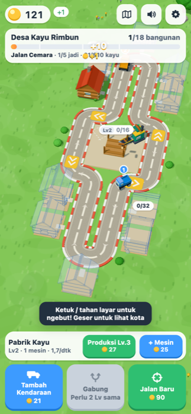
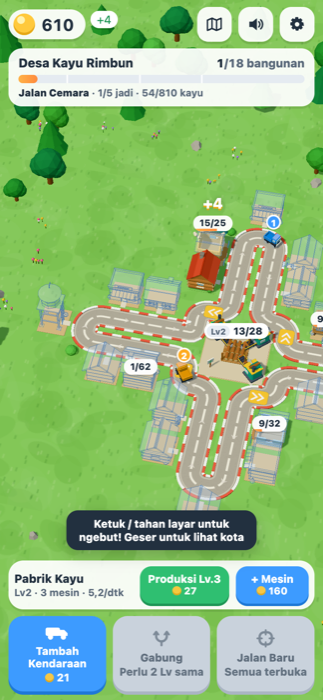
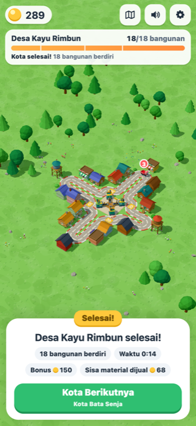
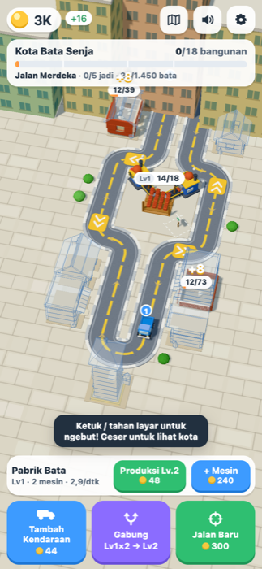

# Loop Builders — Kota Bercabang

Game web 3D idle/clicker satu tangan (Vite + TypeScript + Three.js). Pabrik di tengah kota memproduksi bahan bangunan. Truk mainan mengambilnya di teluk muat, lalu berkeliling jalan yang bercabang ke empat arah untuk membangun rumah-rumah di kedua sisi jalan. Setiap rumah yang sudah jadi membayar **sewa** tiap kali truk lewat. Ini "reward line" ala Galactic Merge, hanya saja di sini jumlahnya bertambah seiring kota tumbuh.

Semua visual dibuat prosedural dengan geometri Three.js, dan semua suara disintesis dengan Web Audio. Tidak ada aset eksternal, backend, login, iklan, atau pembayaran.

   

## Menjalankan

```bash
npm install
npm run dev      # buka URL yang dicetak Vite (default http://localhost:5180)
npm run build    # type-check (tsc) + build produksi ke dist/
npm run preview  # menyajikan hasil build
npm test         # unit test (Vitest)
npm run check    # tsc --noEmit + semua tes
npm run balance  # bot pacing: cetak timeline kedua kota
npm run deploy   # build + publikasikan dist/ ke branch gh-pages (GitHub Pages)
```

Butuh Node 18+ dan browser dengan WebGL. Tambahkan `?frame=390x844` pada URL untuk memaksa ukuran kontainer ponsel di desktop (khusus pengujian).

## Kontrol

| Aksi | Sentuh / mouse | Keyboard |
| --- | --- | --- |
| Ngebut (boost) | Ketuk area dunia untuk dorongan singkat, tahan untuk mempertahankan (batas energi ±7 dtk, meter biru) | Tahan `Spasi` |
| Geser kamera | Seret jari/mouse di area dunia | — |
| Zoom | Cubit dua jari / scroll mouse | — |
| Lihat seluruh kota | Tombol peta di kanan atas | `O` |
| Tambah truk | **Tambah Kendaraan** | `A` |
| Gabung | **Gabung** (pasangan termurah), atau ketuk truk lalu truk lain yang setingkat | `M` |
| Buka jalan | **Jalan Baru** | `E` |
| Pabrik | **Produksi Lv.** (lebih cepat) dan **+ Mesin** (tambah jalur conveyor) | `U` / `N` |
| Kota berikutnya | Tombol di panel selesai | `Enter` |

Ketukan pada tombol HUD atau truk tidak memicu boost. Seretan lebih dari 12 px otomatis berubah dari boost menjadi geser kamera.

## Loop permainan

1. **Pabrik** (1–4 mesin) memproduksi material. Item berjalan di conveyor, lalu masuk ke **satu penyimpanan bersama**. Hanya stok yang sudah tiba di penyimpanan yang bisa diambil. Ruang penyimpanan dipesan sejak item lahir; saat penuh mesin berhenti dan label berubah menjadi **PENUH**.
2. Jalan mengelilingi pabrik, dan di tiap sisinya ada **teluk muat** kuning. Jumlah yang diambil truk adalah `min(stok, kapasitas − muatan)`, jadi truk mengisi ulang sebelum masuk ke setiap jalan.
3. Setiap **jalan** keluar dari sisi pabrik sebagai dua lajur (berangkat dan pulang) dengan putaran U di ujungnya. Kavling berjajar di kedua sisi jalan dan satu lagi di ujungnya.
4. Truk yang melintasi kavling:
   - **belum jadi** → truk menurunkan bahan sebanyak yang masih dibutuhkan (isi-dulu), dan sisanya dibawa ke kavling berikutnya. Modul bangunan langsung berubah dari ghost menjadi solid (fondasi → dinding → bukaan → atap → detail). +1 uang per kayu (+2 per bata).
   - **sudah jadi** → sewa dibayar setiap kali truk lewat, dengan koin yang pop dan nadanya naik beruntun.
5. **Jalan Baru** (3× per kota) menumbuhkan jalan berikutnya dengan animasi dan membuka 3–5 kavling baru. Progres, muatan, dan jumlah truk tidak berubah.
6. Bonus diberikan saat satu jalan lengkap. Kota selesai saat semua bangunan berdiri: confetti, kamera menyorot seluruh kota, sisa material dijual, lalu tombol **Kota Berikutnya**.

Bottleneck ditandai hint kecil. "Truk berangkat setengah kosong" berarti pabrik kurang cepat. "Kayu menumpuk di pabrik" berarti armada kurang.

## Konten

| Kota | Tema | Material | Jalan (utara → selatan → timur → barat) | Bangunan |
| --- | --- | --- | --- | --- |
| 1 · Desa Kayu Rimbun | Hutan | Kayu | Cemara, Pinus, Mahoni, Jati | Rumah kayu, rumah papan, warung, rumah panggung, lumbung, rumah loteng, menara air |
| 2 · Kota Bata Senja | Kota | Bata | Merdeka, Sudirman, Thamrin, Diponegoro | Rumah bata, toko roti, ruko, rumah bata tingkat, apartemen, menara jam |

Masing-masing kota berisi 18 bangunan. Setelah kota 2, permainan berputar kembali ke kota 1 dengan target, harga, dan sewa ×1,6.

## Angka awal (Kota 1)

| Parameter | Nilai |
| --- | --- |
| Truk awal | 1× Lv1 (kapasitas 4); kecepatan 5 u/dtk; kapasitas Lv1–Lv6 = 4/10/24/55/120/260 |
| Pabrik | 1 mesin, 1 item / 0,8 dtk; penyimpanan 12 (+4 per level, +6 per mesin) |
| Add | 10, lalu ×1,45 per pembelian |
| Produksi Lv. | 16, lalu ×1,7 per level (+40% per level) |
| Mesin ke-2/3/4 | 25 / 70 / 160 |
| Jalan Baru | 30 / 90 / 150 |
| Bangunan | 20–81 kayu; sewa 1–5 per truk lewat |

Hasil `npm run balance` (bot tanpa boost): kiriman pertama di detik ke-1, rumah pertama jadi ±17 dtk, sewa pertama ±24 dtk, Add dan Gabung ±14 dtk, jalan ke-2 ±55 dtk. Kota 1 selesai ±3,6 menit dan Kota 2 ±3,7 menit, dengan sewa menyumbang sekitar 2/3 pemasukan. Pemain manusia biasanya lebih lambat dari bot.

Semua angka global ada di `src/config/balance.ts`. Kota, jalan, kavling, dan harga ada di `src/config/cities.ts`. Tipe bangunan ada di `src/config/buildings/`.

## Arsitektur

```
src/
  config/        balance.ts, cities.ts (kota/jalan/kavling/harga), buildings/ (generator bangunan)
  game/          logika murni, tanpa Three.js/DOM, dapat diuji di Node
    layout.ts      titik sudut loop per tahap, posisi kavling & teluk muat
    track.ts       TrackPath (poligon bersudut bulat), computeCrossings, StageMapping
    sim.ts         boost, pabrik multi-mesin, gerak truk, pickup, kirim, sewa, bonus
    actions.ts     add, merge, produksi, mesin, jalan baru, kota berikutnya
    economy.ts     rumus + akses konteks kota
    save.ts        save/load (skema v2) + validasi + cadangan save rusak
  render/        world.ts, trackView (jalan + morph), depotView, plotView, buildingView (ghost/solid),
                 vehicleView, stationView (jalur mesin), environment, effects, cameraRig (fit/geser/zoom)
  audio/sfx.ts   synthesizer Web Audio (compressor, batas voice, cooldown, koin sewa berantai)
  ui/            hud.ts, tutorial.ts, format.ts
  app.ts         loop, event → render/audio/HUD, input (boost, geser, cubit), autosave
```

Seluruh jaringan jalan secara teknis tetap **satu loop tertutup**: mengelilingi pabrik, ditambah setiap jalan yang keluar lalu kembali. Karena itu aturan crossing di `track.ts` tetap sederhana dan teruji. Sebuah titik (teluk atau kavling) dianggap dilewati jika berada di interval setengah-terbuka `(prev, prev+move]` sepanjang arah jalan, sehingga boost tidak bisa melompatinya dan tidak ada pemicu ganda. Saat jalan baru dibuka, `StageMapping` memetakan posisi truk ke loop baru dengan menjaga urutan relatif terhadap teluk dan kavling lama, dan jalannya di-morph selama ±1,15 dtk.

## Menambah kota / bangunan

1. **Tipe bangunan baru**: tambahkan entri di `BUILDINGS` pada `src/config/buildings/index.ts`. Pakai generator parametrik `house()` (dinding log/papan/bata, 1–4 lantai, atap pelana/datar, panggung, kanopi, balkon, papan nama), atau tulis generator sendiri seperti `waterTower()`.
2. **Kota baru**: salin satu objek di `CITIES` (`src/config/cities.ts`). Isi tiap jalan dengan `side` (N/E/S/W), `length` (6,6 untuk dua kavling per sisi, 4,3 untuk satu), `unlockStage`, lalu kavling `P(lajur, jarak, tipe, varian, target, sewa)`.
3. Jalankan `npm test`. `tests/layout.test.ts` otomatis memeriksa bahwa kavling tidak menimpa jalan maupun kavling lain, titik jangkar tepat di lajur, urutan kavling sesuai arah truk, loop makin panjang tiap jalan baru, dan kiriman kecil pertama langsung menumbuhkan bangunan.

## Pengujian

`npm test` menjalankan 39 tes:

- **Crossing**: wrap di ujung loop, boost/langkah besar, dan jumlah pemicu yang sama untuk berbagai ukuran langkah.
- **Tata letak kota**: semua tahap dan kedua kota.
- **Pickup**: `min(stok, sisa kapasitas)`, dan item di conveyor tidak bisa diambil.
- **Pabrik**: multi-mesin berhenti saat penuh tanpa kehilangan item, dan invarian stok+conveyor ≤ kapasitas.
- **Kavling**: isi-dulu, sisa muatan lanjut ke kavling berikutnya, sewa dibayar hanya oleh bangunan yang sudah jadi, bonus jalan dibayar sekali, dan penyelesaian kota menjual sisa material.
- **Aksi**: merge (muatan utuh + overflow), mesin maksimal 4, jalan baru tidak mereset progres atau muatan dan menjaga urutan truk.
- **Save/load**: round-trip, save rusak atau versi lama, kota selesai tetap selesai, dan clamp nilai.
- **Pacing**: bot kedua kota.

Selain itu, game sudah diuji di Chrome headless dengan viewport ponsel 390×844 (sentuh): ngebut, Add, Gabung, upgrade, tambah mesin, tiga kali Jalan Baru, geser dan zoom kamera, kota selesai, reload tetap dalam keadaan selesai, lalu pindah ke Kota Bata. Tidak ada error console.

## Keterbatasan

- Belum diuji di ponsel fisik; performa di ponsel kelas bawah belum diukur.
- Jalan hanya bisa keluar dari keempat sisi pabrik (maksimal 4 jalan per kota). Belum ada cabang dari jalan lain maupun upgrade bangunan (rumah naik tingkat).
- Saat seluruh kota sudah terbuka, kamera fokus ke pabrik + jalan yang sedang dibangun agar tetap terbaca di layar portrait. Bagian kota lain dilihat dengan geser/zoom atau tombol peta.
- Audio disintesis dan kualitasnya subjektif. Tidak ada musik latar.
- Tidak ada progres offline: simulasi dijeda saat tab disembunyikan.
