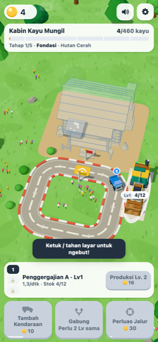
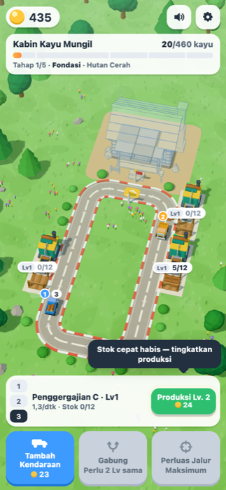
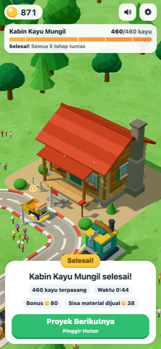
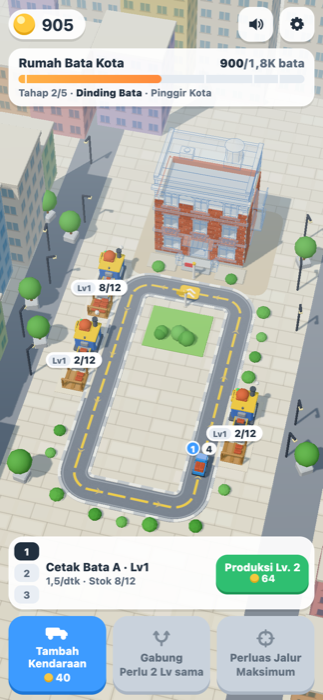

# Loop Builders

**Main sekarang:** https://irvanfaturohman.github.io/loop-builders/

Game web 3D idle/clicker satu tangan (Vite + TypeScript + Three.js). Kendaraan mainan berputar di satu loop tertutup, mengambil material dari penyimpanan mesin produksi, lalu membongkar semua muatan sekaligus untuk membangun rumah. Siluet rumah target terlihat sejak awal dan berubah dari ghost menjadi solid modul demi modul.

Semua visual dibuat secara prosedural dengan geometri Three.js, dan semua suara disintesis dengan Web Audio. Tidak ada aset eksternal, backend, login, iklan, atau pembayaran.

   

## Menjalankan

```bash
npm install
npm run dev      # buka URL yang dicetak Vite (default http://localhost:5180)
npm run build    # type-check (tsc) + build produksi ke dist/
npm run preview  # menyajikan hasil build
npm test         # unit test (Vitest)
npm run check    # tsc --noEmit + semua tes
npm run balance  # bot pacing: cetak timeline ketiga level
```

Butuh Node 18+ dan browser dengan WebGL. Tambahkan `?frame=390x844` pada URL untuk memaksa ukuran kontainer ponsel di desktop (khusus pengujian).

### Deploy ke GitHub Pages

```bash
npm run deploy   # build + push isi dist/ ke branch gh-pages
```

Pages menyajikan branch `gh-pages` (root). `vite.config.ts` memakai `base: './'`, jadi build bisa dibuka dari subfolder `/<nama-repo>/`. Setelah push, perubahan biasanya tayang dalam 1–2 menit.

## Kontrol

| Aksi | Sentuh / mouse | Keyboard |
| --- | --- | --- |
| Ngebut (boost) | Ketuk area dunia untuk dorongan singkat, tahan untuk mempertahankan (batas energi ±7 detik, meter biru) | Tahan `Spasi` |
| Tambah kendaraan | Tombol **Tambah Kendaraan** | `A` |
| Gabung | Tombol **Gabung** (pasangan termurah), atau ketuk kendaraan lalu ketuk kendaraan lain yang setingkat | `M` |
| Perluas jalur | Tombol **Perluas Jalur** | `E` |
| Pilih stasiun | Ketuk mesin/penyimpanan di dunia, atau tab 1/2/3 di panel stasiun | `1` `2` `3` |
| Upgrade / bangun mesin | Tombol hijau di panel stasiun, atau tombol **Bangun Mesin** di slot | `U` |
| Proyek berikutnya | Tombol di panel selesai | `Enter` |
| Suara & reset | Ikon speaker (mute cepat) dan ikon gir (pengaturan, reset dengan konfirmasi) | `Esc` menutup |

Ketukan pada tombol HUD, kendaraan, atau stasiun tidak memicu boost.

## Loop permainan

1. **Mesin** memproduksi satu material per interval. Item berjalan di **conveyor**, lalu baru masuk **penyimpanan**. Hanya stok di penyimpanan yang bisa diambil kendaraan.
2. Mesin hanya melahirkan item jika `stok + item di conveyor < kapasitas`. Artinya ruang dipesan sejak item lahir. Saat penuh, lampu mesin merah, gergaji berhenti, dan label berubah menjadi **PENUH**.
3. **Kendaraan** berkeliling dengan urutan bongkar → A → B → C → bongkar. Di tiap stasiun, jumlah yang diambil adalah `min(stok, kapasitas − muatan)`. Kendaraan yang penuh lewat tanpa mengambil.
4. Di **titik bongkar**, seluruh muatan langsung masuk progres dalam satu langkah logika. Material terbang, debu, dan pop modul hanya efek visual yang tidak menahan logika. Uang = 1 per material (bata di kota = 2) ditambah bonus tiap tahap.
5. **Add**, **Merge** (kapasitas Lv1–Lv6 = 4/10/24/55/120/260), **Produksi Lv.** (+50% throughput dan +4 kapasitas penyimpanan per level), serta **Perluas Jalur** (2× per level) yang memperpanjang loop dan membuka slot mesin baru. Expand tidak mengubah rumah, target, progres, atau muatan.
6. Setelah bangunan selesai: confetti, kamera menyorot rumah tanpa ghost, sisa material dijual, lalu tombol **Proyek Berikutnya**.

Hint kecil di bawah kartu proyek menjelaskan bottleneck: "Kendaraan sering kosong" berarti produksi kurang, "Kayu menumpuk" berarti armada kurang. Tutorial singkat (boost → gabung → tambah → perluas → bangun mesin → upgrade) muncul satu per satu, hanya saat relevan, dan tidak pernah memblokir permainan.

## Konten

| Level | Area | Material | Proyek | Target |
| --- | --- | --- | --- | --- |
| 1 | Hutan Cerah | Kayu | Kabin Kayu Mungil (log cabin, atap pelana merah, teras, cerobong batu) | 460 |
| 2 | Pinggir Hutan | Kayu | Rumah Kayu Dua Lantai (gable depan, sayap, balkon, siding) | 1.200 |
| 3 | Pinggir Kota | Bata | Rumah Bata Kota (3 lantai, atap datar, parapet, tangki air) | 1.800 |

Setiap proyek terdiri dari 68–120 modul dengan urutan fondasi → dinding → rangka/bukaan → atap → detail. Setelah level 3, permainan berputar kembali ke level 1 dengan target dan harga ×1,6.

## Angka awal (Level 1)

| Parameter | Nilai |
| --- | --- |
| Target kayu | 460 (disesuaikan dari referensi 160–200 agar kedua expand sempat dipakai) |
| Mesin pertama | 1 kayu / 0,8 dtk; penyimpanan 12; stok awal 4 |
| Kendaraan awal | 1× Lv1 (kapasitas 4); kecepatan 4,3 u/dtk; loop awal ±4,5 dtk |
| Add | 10, lalu ×1,5 per pembelian |
| Upgrade produksi | 16, lalu ×1,72 per level (+50% throughput) |
| Expand 1 / 2 | 30 / 70 |
| Mesin ke-2 / ke-3 | 20 / 40 |
| Boost | +70%, ketuk = 0,65 dtk, tahan hingga energi habis (±7 dtk), isi ulang ±4,5 dtk |
| Bonus tahap | 10 / 20 / 30 / 40, bonus selesai 80 |

Hasil `npm run balance` (bot tanpa boost yang membeli opsi termurah sesuai bottleneck): Level 1 selesai ±2,7 menit (pengiriman pertama di detik ke-4, Add di detik ke-13, Merge ke-14, Expand 1 ke-60, Expand 2 ke-127). Level 2 selesai ±4,5 menit dan Level 3 ±5,8 menit. Pemain sungguhan biasanya sedikit lebih lambat, dan boost bisa mengimbanginya.

Semua angka global ada di `src/config/balance.ts`, sedangkan angka per level ada di `src/config/levels.ts`.

## Arsitektur

```
src/
  config/        balance.ts (angka global), levels.ts (lintasan, slot, harga), projects/ (modul bangunan)
  game/          logika murni, tanpa Three.js/DOM, dapat diuji di Node
    types.ts       GameState, Vehicle, Station, LevelDefinition, TrackStageDef, ProjectDefinition...
    track.ts       TrackPath (poligon bersudut bulat, panjang eksak), computeCrossings, StageMapping
    sim.ts         step(): boost, produksi/conveyor, gerak kendaraan, pickup, bongkar, bonus
    actions.ts     add, merge, upgrade, bangun mesin, expand, proyek berikutnya
    economy.ts     rumus harga/kapasitas/laju + akses konteks level
    building.ts    pemetaan material → modul (ambang kumulatif)
    save.ts        save/load localStorage dengan versi skema, validasi, dan cadangan save rusak
  render/        Three.js: world.ts (orkestrasi), trackView, stationView, vehicleView,
                 buildingView (ghost/solid), environment, effects (pool partikel), cameraRig, labels
  audio/sfx.ts   synthesizer Web Audio (compressor, batas voice, cooldown)
  ui/            hud.ts, tutorial.ts, format.ts
  app.ts         loop (dt dibatasi + sub-step), event → render/audio/HUD, input, autosave
```

Bagian yang rawan bug diberi komentar di kode:

- **Crossing** (`track.ts`): titik dianggap dilewati jika berada di interval setengah-terbuka `(prev, prev+move]` modulo panjang loop, diurutkan sepanjang arah jalan. Tidak ada pemeriksaan jarak mentah, sehingga boost atau langkah besar tidak bisa melompati trigger dan tidak ada trigger ganda.
- **Buffer conveyor** (`sim.ts`): kapasitas dipesan saat item lahir.
- **Expand** (`track.ts` StageMapping): bagian lintasan yang identik dipetakan 1:1 dan bagian yang berubah dipetakan proporsional. Urutan relatif kendaraan terhadap titik bongkar/pickup tetap sama, lalu jalan di-morph ±1,15 dtk memakai pemetaan yang sama.
- **Ghost** (`buildingView.ts`): prepass kedalaman dengan polygonOffset, lalu warna transparan satu lapis dan garis tepi. Ghost sebuah modul disembunyikan tepat saat solidnya mulai muncul, sehingga tidak ada siluet dobel atau z-fighting.

Performa: ghost dan solid bangunan digabung per frame yang berubah (±4 draw call), sedangkan pohon, semak, item, dan partikel memakai InstancedMesh. Satu frame level penuh sekitar 70–90 draw call. Device pixel ratio dibatasi 2, delta time dibatasi 0,1 dtk dengan sub-step 1/30, dan simulasi berhenti saat tab tersembunyi.

## Menambah level

1. Buat builder proyek baru di `src/config/projects/namaProyek.ts` yang mengembalikan `ProjectDefinition`. Susun modul dengan `ProjectBuilder.mod(tahap, bobot, ...prims)`, urut dari bawah ke atas. Biaya tiap modul dihitung otomatis dari bobot agar totalnya tepat sama dengan `target`.
2. Daftarkan builder itu di `src/config/projects/index.ts`.
3. Tambahkan objek ke `LEVELS` di `src/config/levels.ts`:
   - `trackStages`: tiga konfigurasi lintasan. Titik pertama adalah titik bongkar dan harus berada di tengah ruas lurus. Helper `rectStage()` tersedia.
   - `slots`: posisi mesin dan penyimpanan. Penyimpanan harus di tepi jalan dan urutannya searah jalan.
   - Harga: `expandCosts`, `costScale`, `moneyPerUnit`, `baseInterval`, `startStorage`.
   - `theme`: `forest`, `meadow`, atau `city`. Palet warnanya ada di `src/render/palette.ts`.
4. Jalankan `npm test`. `tests/content.test.ts` memvalidasi otomatis bahwa penyimpanan menempel di jalan, mesin tidak menimpa jalan, urutan bongkar → A → B → C benar, loop membesar tiap tahap, dan pengiriman pertama sudah mengubah rumah.

## Pengujian

`npm test` menjalankan 38 tes:

- **Crossing**: interval setengah-terbuka, wrap di ujung loop, langkah besar/boost, dan jumlah trigger yang sama untuk berbagai ukuran langkah.
- **Pickup**: `min(stok, sisa kapasitas)`, stok 3 hanya menyuplai 3, kapasitas 4 tidak pernah terlampaui, dan item di conveyor tidak bisa diambil.
- **Buffer**: mesin berhenti saat penuh, dan invarian stok+conveyor tidak pernah melebihi kapasitas.
- **Bongkar**: tepat sekali per putaran, seluruh muatan masuk, dan kelebihan setelah target dijual.
- **Boost**: tidak menghilangkan pickup/bongkar.
- **Merge**: muatan terjaga, jumlah kendaraan berkurang, dan overflow bila config diubah.
- **Expand**: progres, proyek, dan muatan tidak berubah, loop lebih panjang, urutan relatif terjaga, dan tetap satu bongkar per putaran.
- **Save/load**: round-trip, save rusak, level selesai tetap selesai, dan clamp nilai.
- **Konten**: validasi tata letak level, pemetaan modul, serta bot pacing ketiga level.

Selain itu, game sudah diuji di Chrome headless (viewport 390×844 sentuh, 360×740, 430×932, landscape 844×390, dan desktop 1280×720). Yang dicoba: boost tap/tahan, Add, Gabung lewat tombol dan lewat ketuk dua kendaraan, dua kali expand dan bangun mesin, upgrade, menyelesaikan rumah, reload pada state selesai, lalu pindah ke Level 2 dan 3. Tidak ada error console dan tidak ada scroll horizontal.

## Keterbatasan yang masih ada

- Belum diuji di ponsel fisik. Pengujian ponsel memakai emulasi viewport dan sentuh di Chrome, jadi performa di ponsel kelas bawah belum diukur. Jika berat, turunkan `shadow.mapSize` di `render/world.ts` atau batas DPR.
- Audio disintesis dan kualitasnya subjektif. Ambience hanya kicau burung sesekali di hutan, tanpa musik latar.
- Tidak ada progres offline. Ini disengaja: saat tab disembunyikan, simulasi dijeda.
- Setelah Level 3, permainan mengulang tiga level yang sama dengan angka lebih besar, belum ada konten baru.
- Merge selalu menaruh hasil di posisi kendaraan pertama. Tidak ada drag-and-drop (merge lewat tombol atau dua ketukan).
- Tidak ada upgrade kecepatan kendaraan. Fitur ini opsional di brief dan sengaja tidak dibuat agar balance tetap sederhana.
