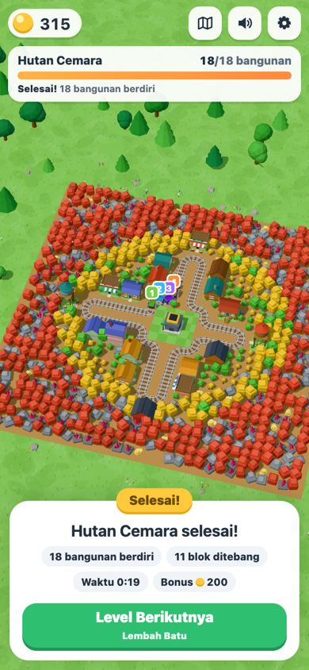

# Loop Builders — Tebang & Bangun

Game web 3D idle/clicker satu tangan (Vite + TypeScript + Three.js). Sebuah kereta dengan gerbong bergergaji berputar di rel yang membelah hutan voxel. Setiap blok di dekat rel ditebang dan hasilnya masuk ke muatan. Stasiun di tengah menjual muatan menjadi koin. Lahan yang sudah bersih berubah menjadi **kavling**, dan kereta memakai kayu atau batu yang ditebangnya untuk membangun rumah di sana. Rumah yang sudah jadi membayar **sewa** setiap kali kereta lewat.

Gameplay menebangnya terinspirasi dari *Train Miner: Idle Railway*. Bedanya, di game ini lahan yang dibuka tidak dibiarkan kosong: di atasnya tumbuh sebuah desa.

Semua visual dibuat prosedural dengan geometri Three.js, dan semua suara disintesis dengan Web Audio. Tidak ada aset eksternal, backend, login, iklan, atau pembayaran.

   

## Menjalankan

```bash
npm install
npm run dev      # buka URL yang dicetak Vite (default http://localhost:5180)
npm run build    # type-check (tsc) + build produksi ke dist/
npm run preview  # menyajikan hasil build
npm test         # unit test (Vitest)
npm run check    # tsc --noEmit + semua tes
npm run balance  # bot pacing: cetak timeline kedua level
npm run deploy   # build + publikasikan dist/ ke branch gh-pages (GitHub Pages)
```

Butuh Node 18+ dan browser dengan WebGL. Tambahkan `?frame=390x844` pada URL untuk memaksa ukuran kontainer ponsel di desktop (khusus pengujian).

## Kontrol

| Aksi | Sentuh / mouse | Keyboard |
| --- | --- | --- |
| Ngebut (boost) | Ketuk area dunia untuk dorongan singkat, tahan untuk mempertahankan (±7 dtk, lalu isi ulang) | Tahan `Spasi` |
| Geser kamera | Seret jari/mouse di area dunia (kamera kembali mengikuti kereta setelah ±3,5 dtk) | — |
| Zoom | Cubit dua jari / scroll mouse | — |
| Lihat seluruh peta | Tombol peta di kanan atas | `O` |
| Tambah gerbong | **Gerbong** | `A` |
| Gabung 2 gerbong setingkat | **Gabung** | `M` |
| Kereta lebih cepat | **Kecepatan** | `S` |
| Muatan lebih besar | **Kapasitas** | `C` |
| Buka rel baru | **Buka Rel** | `E` |
| Level berikutnya | Tombol di panel selesai | `Enter` |

Ketukan pada tombol HUD tidak memicu boost. Seretan lebih dari 12 px otomatis berubah dari boost menjadi geser kamera.

## Loop permainan

1. **Menebang.** Tiap gerbong punya dua gergaji yang menebang blok dalam jangkauannya (makin dekat, makin cepat). Pohon hijau, pohon emas, pohon merah, dan batu menghasilkan kayu atau batu. Kristal menghasilkan permata, dan tumpukan koin langsung memberi uang. Saat muatan penuh, gergaji berhenti dan label di depan lokomotif berubah menjadi **PENUH**.
2. **Menjual.** Setiap kali lewat stasiun, muatan dijual. Stasiun menyisakan bahan bangunan yang masih dibutuhkan kavling yang sudah bersih, jadi kereta tidak pernah berangkat tanpa bahan untuk membangun.
3. **Membuka lahan.** Kavling di sepanjang rel awalnya tertutup hutan dan menampilkan persentase pembersihannya. Begitu semua bloknya ditebang, kavling siap dibangun.
4. **Membangun.** Kereta yang melintasi kavling siap langsung menurunkan bahan (isi-dulu), dan sisanya dibawa ke kavling berikutnya. Modul bangunan berubah dari ghost menjadi solid (fondasi → dinding → bukaan → atap → detail). Bangunan yang sudah jadi membayar sewa setiap kali kereta lewat.
5. **Upgrade.** **Gerbong** menambah gerbong Lv1. **Gabung** menyatukan dua gerbong setingkat menjadi satu gerbong yang gergajinya lebih tajam dan lebih lebar. **Kecepatan** dan **Kapasitas** juga bisa dinaikkan.
6. **Rel baru** (3× per level) menumbuhkan cabang rel ke hutan berikutnya, lengkap dengan animasi, dan membuka 3–5 kavling baru. Progres, muatan, dan gerbong tidak berubah. Hutan makin jauh makin keras: zona hijau → emas → merah dengan batu dan kristal.
7. **Hutan tumbuh kembali.** Tunggul pelan-pelan menjadi pohon lagi (kecuali di lahan kavling), jadi pasokan bahan tidak pernah habis.
8. Level selesai saat semua bangunan berdiri. Muncul confetti, kamera menyorot seluruh peta, sisa muatan dijual, bonus diberikan, lalu tombol **Level Berikutnya** muncul.

## Konten

| Level | Tema | Bahan bangunan | Cabang rel (utara → selatan → timur → barat) | Bangunan |
| --- | --- | --- | --- | --- |
| 1 · Hutan Cemara | Hutan | Kayu | Cemara, Pinus, Mahoni, Jati | Rumah kayu, rumah papan, warung, rumah panggung, lumbung, rumah loteng, menara air |
| 2 · Lembah Batu | Padang | Batu (bangunan bata) | Granit, Marmer, Kapur, Andesit | Rumah bata, toko roti, ruko, rumah bata tingkat, apartemen, menara jam |

Masing-masing level berisi 18 bangunan. Setelah level 2, permainan berputar kembali ke level 1 dengan target, harga, dan sewa yang lebih tinggi. Upgrade kereta direset di setiap level baru, sedangkan uang tetap dibawa.

## Angka awal (Level 1)

| Parameter | Nilai |
| --- | --- |
| Kereta awal | lokomotif + 1 gerbong Lv1; kecepatan 3,4 u/dtk (+0,1 per level); muatan 20 (×1,3 per level) |
| Gergaji | 2,6 dmg/dtk per gerbong Lv1, ×1,8 per tingkat; jangkauan 2,65 (+0,22 per tingkat) |
| Blok | pohon 2 HP → 2 kayu · pohon emas 4 → 3 · pohon merah 7 → 5 · batu 6 → 3 batu · kristal 12 → 1 permata · koin +20 |
| Harga jual | kayu 1, batu 2, permata 10 |
| Gerbong / Gabung / Kecepatan / Kapasitas | 10 / 15 / 20 / 20, lalu ×1,55 / ×1,45 / ×1,6 / ×1,6 |
| Rel baru | 60 / 160 / 320 |
| Bangunan | 16–70 kayu; sewa 1–7 per kereta lewat |

Hasil `npm run balance` (bot tanpa boost yang menabung untuk rel baru setelah cabangnya selesai): tebangan pertama di detik ke-1, rumah pertama jadi ±20 dtk, cabang pertama selesai ±70 dtk. Level 1 selesai ±6,2 menit dan Level 2 ±8,4 menit. Pemasukan terbagi antara penjualan dan sewa.

Semua angka global ada di `src/config/balance.ts`. Level, cabang, kavling, zona hutan, dan harga ada di `src/config/levels.ts`. Tipe bangunan ada di `src/config/buildings/`.

## Arsitektur

```
src/
  config/        balance.ts, levels.ts (level/cabang/kavling/zona hutan), buildings/ (generator bangunan)
  game/          logika murni, tanpa Three.js/DOM, dapat diuji di Node
    layout.ts      sudut loop per tahap, posisi kavling & titik stasiun
    track.ts       TrackPath (poligon bersudut bulat), computeCrossings, StageMapping
    tracks.ts      cache lintasan per level/tahap + pemetaan saat rel baru
    worldgen.ts    grid hutan 1×1 (seed tetap): jenis blok per zona, sel rel & sel kavling
    sim.ts         boost, gerak kereta, gergaji, tumbuh kembali, jual, kirim, sewa, bonus
    actions.ts     gerbong, gabung, kecepatan, kapasitas, rel baru, level berikutnya
    economy.ts     rumus + akses konteks level
    save.ts        save/load (skema v3) + validasi + cadangan save rusak
  render/        world.ts, forestView (InstancedMesh per jenis blok), trainView (lokomotif, gerbong, gergaji),
                 trackView (rel + morph), plotView, buildingView (ghost/solid), environment, effects,
                 labels (label DOM di dunia 3D), cameraRig (ikuti kereta/geser/zoom/overview)
  audio/sfx.ts   synthesizer Web Audio (gergaji, tebang, jual, sewa berantai; compressor & batas voice)
  ui/            hud.ts, tutorial.ts, format.ts
  app.ts         loop, event → render/audio/HUD, input (boost, geser, cubit), autosave
```

Hutan adalah grid sel 1×1. Setiap sel menyimpan HP (>0 hidup, 0 tunggul, −1 kosong/rel) dan progres tumbuh kembali. Rel secara teknis tetap **satu loop tertutup**: mengelilingi stasiun, ditambah setiap cabang yang keluar lalu kembali. Sebuah titik (stasiun atau kavling) dianggap dilewati jika berada di interval setengah-terbuka `(prev, prev+move]` sepanjang arah rel, sehingga boost tidak bisa melompatinya dan tidak ada pemicu ganda. Saat rel baru dibuka, sel-sel di jalurnya dibersihkan, lalu `StageMapping` memetakan posisi kereta ke loop baru dengan menjaga urutan relatif terhadap stasiun dan kavling lama.

## Menambah level / bangunan

1. **Tipe bangunan baru**: tambahkan entri di `BUILDINGS` pada `src/config/buildings/index.ts`. Pakai generator parametrik `house()` (dinding log/papan/bata, 1–4 lantai, atap pelana/datar, panggung, kanopi, balkon, papan nama), atau tulis generator sendiri seperti `waterTower()`.
2. **Level baru**: salin satu objek di `LEVELS` (`src/config/levels.ts`). Isi `buildResource`, `zones` (jenis blok per radius dari stasiun), `seed`, dan tiap cabang dengan `side` (N/E/S/W), `length`, `unlockStage`, serta kavling `P(lajur, jarak, tipe, varian, target, sewa)`.
3. Jalankan `npm test`. `tests/layout.test.ts` otomatis memeriksa bahwa kavling tidak menimpa rel maupun kavling lain, titik jangkar tepat di rel dan urut sesuai arah kereta, hutan menutupi kavling sementara rel awal dan lapangan stasiun bersih, loop makin panjang tiap rel baru, dan kiriman kecil pertama langsung menumbuhkan bangunan.

## Pengujian

`npm test` menjalankan 39 tes:

- **Crossing**: wrap di ujung loop, boost/langkah besar, dan jumlah pemicu yang sama untuk berbagai ukuran langkah.
- **Tata letak**: semua tahap di kedua level.
- **Gergaji**: hanya menebang blok dalam jangkauan, muatan tidak pernah melebihi kapasitas, lahan kavling akhirnya bersih, dan tunggul tumbuh kembali.
- **Stasiun & kavling**: menjual muatan tapi menyisakan bahan yang dibutuhkan, isi-dulu, sewa hanya dari bangunan yang sudah jadi, bonus cabang dibayar sekali, dan level selesai menjual sisa muatan.
- **Aksi**: gerbong, gabung, kecepatan, kapasitas, dan rel baru yang tidak mereset progres, muatan, atau gerbong serta menjaga posisi kereta.
- **Save/load**: round-trip (hutan, kereta, rel, kavling), save rusak atau versi lama, level selesai tetap selesai, dan clamp nilai.
- **Pacing**: bot memainkan kedua level sampai selesai tanpa softlock.

Selain itu, game sudah diuji di Chrome headless dengan viewport ponsel 390×844 (sentuh), desktop 1440×900, dan landscape 844×390. Skenario yang diuji: menebang, gerbong, gabung, upgrade, rel baru, kamera mengikuti kereta, level selesai, reload tetap dalam keadaan selesai, lalu pindah ke Lembah Batu. Tidak ada error console.

## Keterbatasan

- Belum diuji di ponsel fisik; performa di ponsel kelas bawah belum diukur.
- Rel hanya bisa bercabang dari keempat sisi stasiun (maksimal 4 cabang per level).
- Label kavling bisa saling tumpuk saat kamera di-zoom jauh.
- Audio disintesis dan kualitasnya subjektif. Tidak ada musik latar.
- Tidak ada progres offline: simulasi dijeda saat tab disembunyikan.
